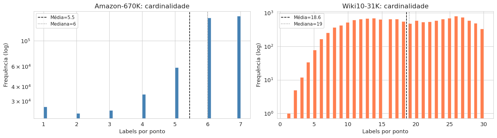
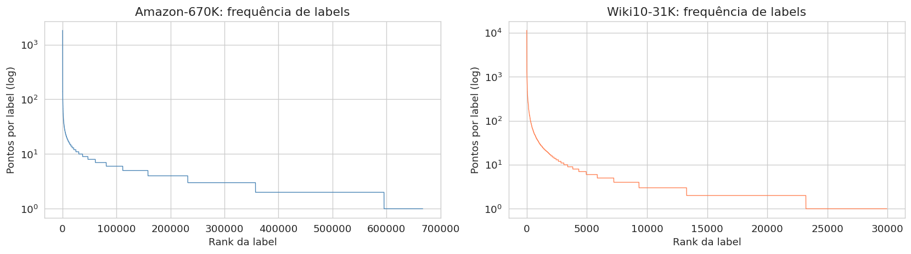
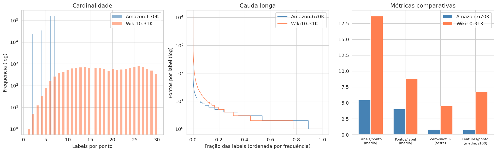

# Resultados da Análise Exploratória: Amazon-670K e Wiki10-31K

## 1. Estatísticas Gerais

| Atributo | Amazon-670K | Wiki10-31K |
|---|---|---|
| Treino | 490.449 | 14.146 |
| Teste | 153.025 | 6.616 |
| Features (dimensões BoW) | 135.909 | 101.938 |
| Labels únicas | 670.091 | 30.938 |
| Labels/ponto (média) | 5,45 | 18,64 |
| Labels/ponto (mediana) | 6 | 19 |
| Pontos/label (média) | 4,01 | 8,81 |
| Densidade da matriz Y (%) | 0,00081 | 0,06025 |
| Sparsidade X | 99,944% | 99,339% |
| Sparsidade Y | 99,999% | 99,940% |

---

## 2. Distribuição de Labels por Ponto (Cardinalidade)

### Amazon-670K

* Média 5,45 / mediana 6 / desvio padrão 1,7
* Mínimo 1, **máximo 7**, teto de 7 labels por ponto no dataset
* p25=5, p75=7, p90=7, p95=7, p99=7: a distribuição se concentra fortemente entre 5 e 7
* A maioria dos pontos tem exatamente 5, 6 ou 7 labels

### Wiki10-31K

* Média 18,64 / mediana 19 / desvio padrão 6,7
* Mínimo 1, **máximo 30**, teto de 30 labels por ponto
* p25=13, p75=25, p90=27, p95=29, p99=30: distribuição mais espalhada que o Amazon
* Maior cardinalidade e variância

---

## 3. Distribuição de Pontos por Label (Cauda Longa)

| Faixa | Amazon-670K | Wiki10-31K |
|---|---|---|
| Labels sem ocorrência no treino | 2.774 (0,4%) | 991 (3,2%) |
| Labels com exatamente 1 ponto | 10,8% | 22,5% |
| Labels com até 5 pontos | **83,3%** | **80,4%** |
| Labels com 10 ou mais pontos | 5,5% | 11,4% |
| Labels com 100 ou mais pontos | 0,1% | 1,1% |
| Labels com 1.000 ou mais pontos | 0,0% | 0,1% |

* Mais de 80% das labels em ambos os casos têm 5 ou menos exemplos no treino

---

## 4. Cobertura Treino / Teste (Zero-Shot Labels)

### Amazon-670K

* 667.317 labels únicas no treino; 347.198 no teste
* 344.424 labels do teste (99,2%) já aparecem no treino
* 2.774 labels do teste (0,8%) são zero-shot

### Wiki10-31K

* 29.947 labels únicas no treino; 22.051 no teste
* 21.060 labels do teste (95,5%) já aparecem no treino
* 991 labels do teste (4,5%) são zero-shot

---

## 5. Esparsidade das Matrizes de Features (BoW)

### Amazon-670K

* Média de 75,7 features não-zero por ponto (mediana=48, p90=167, máximo=2.025)
* Sparsidade X de 99,944%: cada ponto usa em média apenas 0,056% das 135.909 dimensões

### Wiki10-31K

* Média de 673,4 features não-zero por ponto (mediana=520, p90=1.435, máximo=3.288)
* Sparsidade X de 99,339%: cada ponto usa em média 0,66% das 101.938 dimensões
* ~9x mais features ativas por ponto que o Amazon

---

## 6. Comparação entre os Datasets

| Critério | Amazon-670K | Wiki10-31K |
|---|---|---|
| Cardinalidade (labels/ponto) | 5,45 (baixa, teto 7) | 18,64 (alta, teto 30) |
| Cauda longa de labels | Extrema (83% com <=5 pts) | Alta (80% com <=5 pts) |
| Zero-shot no teste | 0,8% | 4,5% |
| Features ativas/ponto | 76 (muito esparso) | 673 (moderado) |
| Texto bruto disponível | Sim (JSONL, média 240 tokens) | Não (somente BoW) |